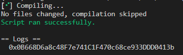
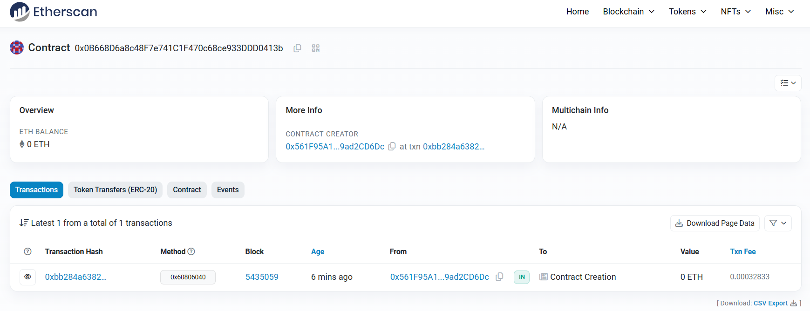

# 2024-Spring-HW0

All the detailed specified in Homework 0 documentation.

## Wallet Address
Please provide your MetaMask wallet address

Wallet address:0x561F95A1dcb8E18132305a88FDbee799ad2CD6Dc

## Local Testing
Please provide a screenshot of the `forge test -vvv` command running in your local environment.

## Contract Address
Please provide the contract address that you deployed on the Sepolia network.

Contract address:0x0B668D6a8c48F7e741C1F470c68ce933DDD0413b

## Sepolia Etherscan
Paste the contract address into the Sepolia Etherscan and share the screenshot.

